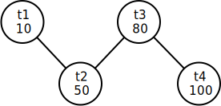

# LAB 5 优化器

## 实验概述

本次实验主要关注于数据库系统的查询计划优化过程，重点关注于逻辑优化中的连接顺序选择。通过实现简单的基数估计算法和连接顺序选择算法，让同学们对于数据库系统中逻辑优化的过程有更进一步的理解。

## 实验任务

本次实验主要有 3 个任务：

1. 实现直方图的数据结构。
2. 补全 Filter 算子的基数估计过程。
3. 完成 Optimizer 中连接顺序优化过程。

实验开始前，请按照文档中[更新说明](https://thu-db.github.io/dbtrain-tutorial/intro.html#%E6%9B%B4%E6%96%B0%E8%AF%B4%E6%98%8E)中的步骤合并新增代码。

## 相关模块

1. utils/graph: 实现了基于邻接表的无向图
2. optim/stats_manager: 用于管理统计信息，包括直方图的存储

## 基础功能实现顺序

1. utils/histogram.cpp: 补全直方图的构建和估计函数。
2. optim/stats_manager.cpp: 补全读取表的数据并构建直方图的过程。
3. oper/basic_node.cpp: 补全 Filter 算子的基数估计过程。
4. optim/optim.cpp: 完成 Optimizer 中连接顺序优化过程。

## 连接顺序优化示例

下面，结合一个简单的示例来解释连接顺序的优化过程。此处以 30 测例中第一条查询语句为例：

```sql
explain select t2.id from t1, t2, t3, t4 where t3.score < 80.0 and t4.id = t3.id and t3.id = t2.id and t2.id = t1.id;
```

经过基数估计过程，可以得出各个表对应的执行树算子基数分别约为：

| 表名 | 基数  |
| :--: | :---: |
|  t1  |  10   |
|  t2  |  50   |
|  t3  | 约 80 |
|  t4  |  100  |

此时，我们以表作为结点，连接关系作为边，可以生成一张无向的连接图。



考虑到 join 基数估计较为困难，基础功能只需使用一种非常简单的启发式算法，从最小基数结点出发依次添加相邻最小基数结点的贪心过程。

实际执行过程如下：

1. 首先，选择最小基数结点 t1，此时邻接结点集合为{t2}，已连接结点集合为{t1}
2. 当邻接结点集合不为空时，从邻接结点集合取出最小基数结点添加到已连接结点集合，本步骤即为取出 t2，此时邻接结点集合为{}，已连接结点集合为{t1,t2}。
3. 将新添加结点的所有不在已连接集合的邻接结点加入到邻接结点集合，本步骤将添加 t3，此时邻接结点集合为{t3}。
4. 重复 2,3 直至邻接结点集合为空。
5. 注意，每次步骤 2 取出新结点时，新的结点和已经完成连接的部分存在且仅存在 1 条连接关系（不考虑多列连接），每次执行步骤 2 时按顺序记录这条连接关系，取出{t2}时连接顺序为{t1.t2}，取出 t3 时连接顺序为{t1.t2, t2.t3}...。
6. 在步骤 4 执行完成时，最终连接顺序确定为{t1.t2, t2.t3, t3.t4}。之后只需要修改 LAB3 中生成执行计划树的顺序即可。

## 测试说明

本次实验主要考察多表连接顺序的选择，测试中主要使用了 analyze 和 explain 指令。

analyze 指令用于生成直方图，计算当前数据库所有表的数值型列的统计信息，保存至 StatsManager 的 stats_map\_ 中。**统计信息只要求保存至内存，无需持久化到磁盘。**

explain 指令用于打印查询计划树结点，本次实验主要涉及投影结点（Project Node）、连接结点（Join Node）、选择结点（Filter Node）和扫描结点（Table Scan Node）。

测试数据库中共有 4 张表：

```
t1(id int, score float): 共 10 行
t2(id int, id2 int, score float): 共 50 行
t3(id int, score float, temp float): 共 100 行
t4(id int, id2 int, score float): 共 100 行
```

id 列为从 1 开始的递增序列。

id2 列为从 -1 开始的递减序列。

score 列为均匀随机值，范围 [0, 100]。

temp 列为均匀随机值，范围 [35, 38]。

score 列和 temp 列分布独立。

根据结点高度不同，打印结点前会先打印一定数量的'\t'，高度相同的结点打印的'\t'数量相同。

例如，对于以下 SQL 语句：

```sql
explain select t2.id from t1, t2, t3 where t3.id = t1.id and t3.id = t2.id and t3.score < 30.0 and t3.temp < 36.0;
```

一种可能的查询计划树如下：


该计划树打印后如下所示：

```
Select:
	Project Node:
		Join Node:
			Join Node:
				Filter Node:
					Table Scan Node(t3):
				Table Scan Node(t1):
			Table Scan Node(t2):
```

本次实验主要关注连接顺序的选择，对测试数据的每条 SQL 语句，需确保优化器选择了正确的连接顺序。对于以上示例，需确保表 t3 和 t1 先连接，其次再和表 t2 连接。

对于同一树高的左右结点顺序没有要求，因此以下几个查询计划树都可以通过测试：

```
Select:
	Project Node:
		Join Node:
			Table Scan Node(t2):
			Join Node:
				Filter Node:
					Table Scan Node(t3):
				Table Scan Node(t1):
```

```
Select:
	Project Node:
		Join Node:
			Table Scan Node(t2):
			Join Node:
				Table Scan Node(t1):
				Filter Node:
					Table Scan Node(t3):
```

此外，在连接顺序重排的过程中，需要确保两表之间存在连接条件，如对于 SQL

```
explain select t2.id from t1, t2, t3, t4 where t3.score < 80.0 and t4.id = t1.id and t4.id2 = t2.id2 and t4.id = t3.id;
```

虽然 t1 和 t2 是基数最小的两个表，但由于 t1 和 t2 之间没有连接条件，所以不能将 t1 和 t2 优先连接。

## 可选高级功能

不要求将高级功能集成到主分支中，建议单开分支完成实验。但是建议同学们设计验证自己实验结果的测例并给出测试的可视化结果展示。

1. 投影算子下推(2 分:简单情况 1 分+复杂情况 1 分)：投影算子下推是一个经典的逻辑优化，通过提前执行投影算子减少算子间的数据传输量来达到优化效果。操作的主要难点在于提前解析查询树来确定需要投影的列（OperNode 额外存储信息或添加额外的解析过程两种方法均可），并在执行器模型中的逐层传递中维护列 ID 的变化。需要设计对应的测例并对比查询计划。其中简单情况仅要求投影算子到最底层 TableScan 的下推过程，占 1 分；复杂情况需要考虑到部分中间层算子同样可以支持投影下推，例如 select t.a from t where t.b < 1; 需要在 TableScan 后添加 a,b 的投影算子，并在 Filter 之后添加 a 的投影算子。复杂情况的测例需要添加至少 2 表 JOIN，并在两个表上各添加至少一个需要下推的中间层算子，占 1 分。
2. 开源数据库基数估计方法调研与实现(2 分)：调研一种现有开源数据库（如 PostgreSQL，MySQL）的基数估计方法，了解现有数据库记录了直方图以外的哪些统计信息，如 PostgreSQL 的 [MCV (most common values) Lists](https://www.postgresql.org/docs/current/row-estimation-examples.html) 等，以及如何利用这些统计信息实现更准确的单表基数估计。在实验框架中存储相应的统计信息，实现对应的基数估计方法，并设计测例证明方法的有效性。

高级功能满分 3 分。

## 报告说明

一门好的课程实验，都是需要多年学生的吐槽和反馈、多届助教和老师一起提升的。本次实验报告除了基本要求外，也欢迎写出对这门课的一些想法、评价和建议，如课程安排、授课方式、实验难度和工作量等，课程进行过程中有哪些好和不好的地方，未来这门课程也会根据大家的建议不断更新和改良。

## 截止时间

2023 年 5 月 21 日（第十三周周日）晚 23:59 分。
