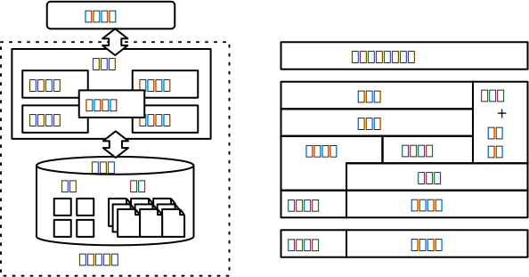

# HuaDB 数据库内核课程实验文档

本课程实验框架进行了模块划分，每次实验关注 1-2 个功能模块，整体层次划分如下，左侧为功能示意图，右侧为层次架构图：

## 代码结构 { #structure }

实验框架主要包含以下几个模块，加粗部分为实验中涉及到的，需要你来补充的模块：

-   binder: 语义解析模块
-   catalog: 系统表模块
-   common: 工具模块，包含字符串处理函数、异常相关类等
-   database: 数据库引擎
-   **executors: 查询执行模块**
-   **log: 日志模块**
-   operators: 查询计划树节点
-   **optimizer: 优化器**
-   planner: 查询计划生成模块
-   **storage: 存储模块**
-   **table: 表相关类及函数**
-   **transaction: 事务模块**

## 联系方式 { #contact }

如在实验过程中遇到任何问题，选课同学可通过微信群或网络学堂与助教联系，其他同学可通过邮箱 [424026452@qq.com](mailto:424026452@qq.com) 与我们联系。
