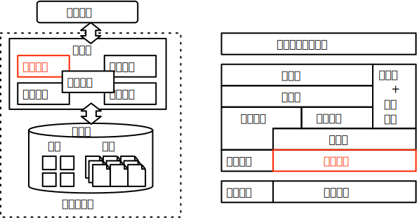

# 实验 1:缓存管理与页面组织

## 实验概述

本次实验为缓存管理与页面组织的实验，意图通过实现记录的页面组织和经典缓存替换算法来更好地理解数据库系统页面管理模块的相关功能。

数据库页面管理承担了数据库系统中内存与磁盘的交互枢纽，一方面通过页面缓存的管理实现高效的磁盘页面访问，同时需要具备将不同类型数据页面解析成特定格式化数据的功能，以便于应对上层不同功能模块的各类 API 接口调用。

页面替换算法和高效率的页面组织是页面管理的难点。高效的磁盘访问依赖于缓存的高命中率，但不规则的页面访问模式增大了缓存替换算法的设计难度；而页面组织需要充分考虑不同类型的页面（记录、索引等）的同时需要结合数据压缩、数据加密等技术保证效率和安全性。全部实现上述内容对于本次实验来讲过于宏大，因此在本次实验的基础功能中，仅要求完成常规的变长形式记录数据的页面组织和经典的 LRU 缓存替换算法。

## 实验目标

本次实验要求完成如下基础功能：

1. 变长记录页面组织：将长度不等的变长记录按照页面形式进行数据组织，实现对于变长记录页面的增删改查操作。

2. LRU 缓存替换算法：基于页面的访问序列管理缓存池，按照 LRU 缓存替换策略进行换出缓存页面的选择。

在基础功能之上，实验框架支持完成以下高级功能：

1. 垃圾回收机制：实验框架中采用标记方式删除数据，在此基础上添加 vacuum 功能，实现主动垃圾回收机制。

2. 优化堆表的插入效率：实验框架中数据表按照堆表形式进行组织，在此基础上设计多级空闲空间数组优化数据插入效率。

## 关联知识点

本次实验关联课件数据库存储章节，重点涉及如下的知识点：

1. 页面组织：变长记录的页面组织任务将涉及到变长记录的组织方式
2. 文件组织：堆表的插入效率优化任务将涉及到堆表组织、空闲空间数组的设计
3. 缓冲区：缓存替换算法的实现将涉及到各类缓存替换策略的原理与算法流程

## 相关代码模块

本次实验涉及到代码中如下的功能模块：

-   [table](https://git.tsinghua.edu.cn/dbtrain/dbtrain-lab/-/tree/master/src/table)：数据表相关类

    -   [record](https://git.tsinghua.edu.cn/dbtrain/dbtrain-lab/-/blob/master/src/table/record.h)：记录类，已经完成。
    -   [table](https://git.tsinghua.edu.cn/dbtrain/dbtrain-lab/-/blob/master/src/table/table.h)：数据表类，需要补充记录插入和删除函数。
    -   [table_page](https://git.tsinghua.edu.cn/dbtrain/dbtrain-lab/-/blob/master/src/table/table_page.h)：变长记录页面类，需要补充页面内部记录插入和删除的函数。
    -   [table_scan](https://git.tsinghua.edu.cn/dbtrain/dbtrain-lab/-/blob/master/src/table/table_scan.h)：用于全表扫描，需要补充获取下条记录的函数来实现数据遍历。

-   [storage](https://git.tsinghua.edu.cn/dbtrain/dbtrain-lab/-/tree/master/src/storage)：用于管理内存和外存的交互
    -   [buffer_strategy](https://git.tsinghua.edu.cn/dbtrain/dbtrain-lab/-/tree/master/src/storage/buffer_strategy.h)：缓存替换算法的抽象类。
    -   [lru_buffer_strategy](https://git.tsinghua.edu.cn/dbtrain/dbtrain-lab/-/tree/master/src/storage/lru_buffer_strategy.h)：LRU 缓存替换算法类，需要补全实现。

相关功能模块的抽象示意图如下：

## 基础功能

基础功能侧重于函数功能的补全，通过阅读相关函数的输入输出描述以及函数解释即可完成。

### 变长记录的页面组织

#### 实验描述

补全 table 文件夹下数据表的相关函数以实现按照堆表格式组织的变长记录页面管理功能。

#### 实现思路

页面组织的核心是将格式化的不定长记录组织到固定大小的页面文件中，便于后续存储到持久化磁盘。可以按照如下的顺序完成本次实验：

-   步骤 1：补全 table_page.cpp，实现单个页面内的记录操作

该文件为变长的记录页面管理的相关函数实现，本次实验中需要先补全对于页面内的相关操作：包括页面内记录的插入、删除、更新、获取。
该类内的函数用于将格式化的记录组织到无格式的页面中，从而实现内存数据到磁盘中无格式数据的转化。

-   步骤 2：补全 table.cpp，以堆表的格式管理单个记录

该文件为堆表的实现，用于向查询处理过程中的各种查询算子提供一种整体上的便于访问的数据表接口，让上层算子不需要关注底层数据表的实现方式。
实验框架中选择实现上最简单的堆表作为数据表的组织方式。本次实验中需要补全数据表级别的增删改查函数。需要依赖于步骤 1 中完成的接口。

完成上面两个步骤即可补全页面组织的功能。

### LRU 缓存替换算法

#### 实验描述

补全 storage 文件夹下的 LRU 缓存替换策略类，实现页面缓存池的 LRU 缓存替换策略。

#### 实现思路

缓存替换的核心是基于输入的页面访问序列，选择按照算法标准设计的换出页面编号。可以按照如下的顺序完成本次实验：

-   步骤 1：补全 lru_buffer_strategy.h，设计 LRUBufferStrategy 类

BufferStrategy 采用了经典的策略模式。默认的函数模板提供了缓存池调用的接口，用具体的替换策略补全纯虚的抽象接口。
首先需要再 LRUBufferStrategy 类中添加记录信息所需的成员变量。

-   步骤 2：补全 lru_buffer_strategy.cpp，补全空缺的 Access 和 Evict 策略接口。

Access 函数：表示发生了页面访问，根据访问页面更新步骤 1 中添加的成员变量。

Evict 函数：按照 LRU 算法的规则，利用步骤 1 中添加的成员变量确定最久未使用的页面作为换出页面即可。

完成上面两个步骤即可补全 LRU 缓存替换算法。

## 基础功能实现顺序

## 高级功能

高级功能侧重于系统模块的关联分析，需要进一步挖掘函数的调用关系和各个模块之间的关联。分析不同类之间的功能差异和数据传递方式才能比较全面地实现高级功能。

### 垃圾回收

#### 实验描述

基础功能中删除仅采用标记删除的方法，没有添加垃圾回收的功能，高级功能要求在此基础上补全 vacuum 机制，实现主动垃圾回收功能。

#### 实现思路

-   步骤 1：理解 DatabaseEngine::ExecuteSql 函数的实现，在类中补充 vacuum 的实现接口。

-   步骤 2：思考 vacuum 过程中节约空间的收益与执行 vacuum 的 IO 成本，根据课程内容设计一种合理的算法流程（主要思考合并范围、合并阈值等）。

-   步骤 3：在 Table 和 TablePage 类中添加支持 vacuum 操作的函数，根据步骤 2 策略实现 vacuum 函数。

### 优化堆表的插入效率

#### 实验描述

基础功能中仅要求实现最简单的逐页遍历的方式来选择记录的插入页面，高级功能要求在此基础上添加空闲空间数组加速记录插入页面的选择过程。同时设计新的页面结构，按照页面的方式管理空闲空间数组。

#### 实现思路

-   步骤 1：设计内存中的空闲空间数组，建议在 Table 中单独添加新的类用于管理空闲空间数组。

-   步骤 2：空闲空间数组的页面化管理，按照 TablePage 的思路设计新的页面结构。将空闲空间数组组织为页面格式进行存储，并在新建 Table 类后从文件导入。

<!--TODO:添加部分教材中的示意图-->

## 实验报告

实验报告应该具备如下 3 部分内容：

-   基础功能的新增成员变量和函数

以模块（文件夹）为划分标准，分栏目介绍在实验中新增的成员变量与成员函数，并简要概括其作用。

-   基础功能的难点总结

总结在完成基础功能中遇到的实现或理解方面的难点，分要点记录于这部分，建议不超过 5 点。

-   **高级功能的设计与实现**

这部分可以作为报告的重点内容，要求详细阐述高级功能的设计思路与实现方法。
可以按照如下流程进行介绍：

(1) 相关原理与示意图：总结高级功能对应的知识点，并绘制示意图。

(2) 新增类的描述：介绍在基础框架之上添加的新的类的功能，以及和已有一些类的关联关系。

(3) 新增成员函数的描述：介绍新增或已有类上增加的重要成员函数，以及这些函数的功能描述和调用关系。

(4) 高级功能效果展示：结合新增或已有的测试用例，说明新增的高级功能的正确性或优化效果。

## 问题反馈

### 框架 BUG 反馈

有关于实验框架的问题可以在公开仓库中提交[git issues](https://git.tsinghua.edu.cn/dbtrain/dbtrain-lab/-/issues/new)。
或者直接提交包含问题描述和修复补丁的[pull request](https://git.tsinghua.edu.cn/dbtrain/dbtrain-lab/-/merge_requests/new)。
