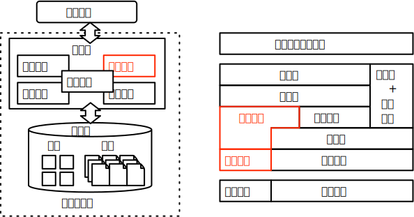

# 实验 2: 事务处理与故障恢复

## 实验概述

本次实验为事务处理与故障恢复的实验，意图通过实现数据库日志机制和经典故障恢复算法来更好地理解数据库系统维持事务 ACID 特性的底层实现。

事务处理事数据库系统最核心的功能之一。数据库系统必须保证事务处理的任意过程中意外的系统宕机不会影响事务的 ACID 特性，但出于性能因素考量的 steal+no-force 的脏页刷盘机制让故障情况下磁盘页面的数据违背原子性和持久性。此时，事务处理过程中的日志机制和故障后的恢复算法就起到了至关重要的作用。过顺序追加的日志记录和故障恢复算法对于页面状态的恢复在保证了系统高效性的同时维持了事务的正常运行。

日志格式的设计和故障恢复算法实现是本次实验的难点。日志设计上需要考虑自身保存的数据需要能够支持重做（Redo）或撤销（Undo）操作，并且需要兼顾存储空间和恢复速度（物理和逻辑日志的差异）。故障恢复算法则需要避免记录无用的日志记录以此来维持尽可能低的故障恢复时间。同时，日志和故障恢复的机制要求能覆盖系统在任意时刻宕机的异常情景。本次实验要求完成物理日志的设计和经典的 ARIES 故障恢复算法。

## 实验目标

本次实验要求完成如下基础功能：

1. 物理日志的设计：设计物理日志的存储格式，并实现单个日志的重做和撤销函数。

2. ARIES 故障恢复算法：补全分析、重做、撤销三个阶段的函数实现，实现 ARIES 故障恢复算法。

在基础功能之上，实验框架支持完成以下高级功能：

1. 故障恢复过程中的异常处理：实验框架中仅考虑系统仅考虑系统在查询执行中的异常处理，在此基础上添加恢复过程中的异常处理机制，核心为补偿日志机制的实现。

2. 非阻塞检查点机制：实验框架中 Checkpoint 采用阻塞的信息写出方式，在此基础上单开线程实现非阻塞的 Checkpoint 机制，核心为修改 BeginCheckpointLog 和 EndCheckpointLog 的实现。

## 关联知识点

本次实验关联事务管理以及故障恢复章节，重点涉及如下的知识点：

1. 事务的概念：完成本次实验需要理解事务的原子性和持久性的概念。
2. 日志实现方式：物理日志的设计将涉及物理日志的存储格式和物理日志在故障恢复中的性质与作用。
3. ARIES 恢复算法：ARIES 算法的实现将涉及 ARIES 的应用场景和算法流程。

## 相关代码模块

本次实验涉及到代码中如下的功能模块：

-   [log](https://git.tsinghua.edu.cn/dbtrain/dbtrain-lab/-/tree/master/src/log)：日志相关类

    -   [log_record](https://git.tsinghua.edu.cn/dbtrain/dbtrain-lab/-/tree/master/src/log/log_record.h)：各类日志的抽象类，用于衍生出各种具体日志，已经完成。
    -   [log_manager](https://git.tsinghua.edu.cn/dbtrain/dbtrain-lab/-/tree/master/src/log/log_manager.h)：日志管理器，负责日志的记录以及故障恢复的具体执行过程，需要补充恢复算法。
    -   [log_records](https://git.tsinghua.edu.cn/dbtrain/dbtrain-lab/-/tree/master/src/log/log_records)：各类具体的物理日志类，需要补充其中记录增删改日志的重做和撤销。

-   [table](https://git.tsinghua.edu.cn/dbtrain/dbtrain-lab/-/tree/master/src/table)：数据表相关类
    -   [table](https://git.tsinghua.edu.cn/dbtrain/dbtrain-lab/-/tree/master/src/table/table.h)：在实验 1 的基础上添加记录变更时的日志记录功能。

相关功能模块的抽象示意图如下：

## 日志
