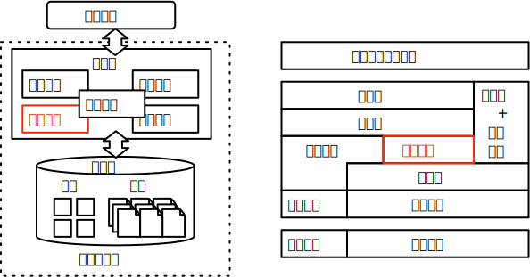

# 实验 3:多版本并发控制

## 实验概述
本次实验为数据库系统并发控制的实验，意图通过实现多版本并发控制机制来让学生们更好地理解数据库系统如何以非阻塞方式处理并发查询处理中读写和写读冲突。

并发查询处理是数据库系统维持高效率、高性能运行的必要条件。但是在并发查询处理中不可避免地会遇到不同事务同时访问相同数据区域的情景，可能发生读写、写读或者写写冲突。
虽然严格按照读写锁的机制执行查询可以保证查询处理的绝对正确性，但是阻塞的处理方式将让查询性能将受到严重限制。在此基础上，为了避免读写和写读冲突造成的系统阻塞问题，多版本并发控制技术得以发展。通过维持多个版本的记录信息，结合版本可见性的控制，数据库系统可以在无阻塞条件处理读写和写读冲突。

并发控制信息的维护和记录可见性分析是本次实验的难点。多版本并发控制依赖于记录所额外存储的版本信息，这要求在记录发生变更时需要同时更新记录的版本信息；同时需要实现记录级别或者页面级别的锁机制来应对写写冲突。在多版本并发控制的架构中，单个记录可以同时维持多个不同的版本来应对不同的事务上下文环境，读取的效率一方面要求系统能够根据版本信息和事务上下文快速确定不同记录版本对于特定事务的可见性，另一方面随着记录版本数量的增加，高效的记录查找机制和过期数据的清理机制才能保证查询性能不会受到严重的负面影响。本次实验要求补全解决读写和写读冲突的多版本并发控制，以及两阶段锁协议解决基本写写冲突，而涉及死锁问题的复杂写写冲突以及垃圾回收机制作为可选的高级功能。

 

## 实验目标
本次实验要求学生完成如下基础功能：

1. 多版本并发控制：修改数据表的增删改查操作，添加版本信息的记录以及记录对于事务的可见性判断。

2. 悲观并发控制：补全锁管理器和算子的锁申请，实现两阶段锁协议，解决并发查询处理中的写写冲突问题。

在基础功能之上，实验框架支持学生完成以下高级功能：

1. 写写冲突的死锁处理：实验框架和测例没有涉及并发查询中写写冲突可能导致的死锁问题，在框架爱基础上加入死锁检测机制来解决死锁问题。

2. 动态垃圾回收机制：实验框架缺少对于过期的记录数据的清理机制，在框架基础上加入过期数据检测的方法以及动态地垃圾回收进制。该步骤建议开启独立线程于后台完成，同时需要考虑到对于前台查询处理进程的影响。

## 关联知识点

本次实验关联课件并发控制章节，重点涉及如下的知识点：

1. 多版本并发控制：本次实验需要充分理解多版本并发控制的原理与实现思路。
2. 悲观并发控制：写写冲突的悲观处理将涉及到悲观并发控制的两阶段锁与死锁内容。

## 相关代码模块
本次实验涉及到代码中如下的功能模块：

- [table](https://git.tsinghua.edu.cn/dbtrain/dbtrain-lab/-/tree/master/src/table/)：数据表相关结构体
    - [table](https://git.tsinghua.edu.cn/dbtrain/dbtrain-lab/-/tree/master/src/table/table.h)：修改实验1中记录的增删改接口，添加版本信息。
    - [table_scan](https://git.tsinghua.edu.cn/dbtrain/dbtrain-lab/-/tree/master/src/table/table_scan.h)：添加判断记录对事务可见性的接口，并修改查询函数。

- [transaction](https://git.tsinghua.edu.cn/dbtrain/dbtrain-lab/-/tree/master/src/transaction/)：事务相关结构体
    - [lock_manager](https://git.tsinghua.edu.cn/dbtrain/dbtrain-lab/-/tree/master/src/transaction/lock_manager.h)：锁管理器，负责管理事务锁，需要补充表级别、行级别加解锁函数以及相关辅助函数。
    
- [excutors](https://git.tsinghua.edu.cn/dbtrain/dbtrain-lab/-/tree/master/src/executors/)：执行器相关结构体
    - [seqscan_executor](https://git.tsinghua.edu.cn/dbtrain/dbtrain-lab/-/tree/master/src/executors/seqscan_executor.h)：需要补充获取事务列表的功能。
    - [insert_executor](https://git.tsinghua.edu.cn/dbtrain/dbtrain-lab/-/tree/master/src/executors/insert_executor.h)：添加插入的写事务锁。
    - [delete_executor](https://git.tsinghua.edu.cn/dbtrain/dbtrain-lab/-/tree/master/src/executors/delete_executor.h)：添加删除的写事务锁。
    - [update_executor](https://git.tsinghua.edu.cn/dbtrain/dbtrain-lab/-/tree/master/src/executors/update_executor.h)：添加更新的写事务锁。
    - [lock_rows_executor](https://git.tsinghua.edu.cn/dbtrain/dbtrain-lab/-/tree/master/src/executors/lock_rows_executor.h)：添加行级别加锁保护功能。

相关功能模块的抽象示意图如下：

## 基础功能

基础功能侧重于函数功能的补全，通过阅读相关函数的输入输出描述以及函数解释即可完成。

### 多版本并发控制

#### 实验描述

多版本并发控制用于解决并发查询处理中的读写和写读冲突，需要在Table相关结构体中添加版本信息以及并在查询记录时判断记录对事务的可见性。

#### 实现思路

- 步骤1：修改Table结构体插入、删除以及更新记录的函数，添加版本信息。

在实验1和2中完成的Table和TablePage的处理中没有考虑到事务的版本信息，需要在本次实验中将其补充。

- 步骤2：补全SeqScanExecutor::Next函数中活跃事务表的获取，用于传递当前活跃事务信息。

多版本并发控制的数据表扫描中需要获取查询执行时的活跃事务表，结合隔离级别生成正确的活跃事务表即可。

- 步骤3：补全TableScan的IsVisible函数，用于在查询记录时判断记录版本对于事务的可见性。

根据隔离级别、记录的版本号以及当前事务的状态信息确定某条记录是否对于该事务可见。这部分是MVCC技术的关键的内容，建议充分理解课程内容后实现。

完成上面三个步骤即可补全多版本并发控制的功能，并通过如下测例：
(测例)
。

### 悲观并发控制

#### 实验描述

悲观并发控制用于解决并发查询处理中写写冲突，需要实现两阶段锁协议来避免不同事务对于相同记录的冲突修改，实验中需要补全锁管理器相关结构体。

#### 实现思路

- 步骤1：补全LockManager的相关函数，完成表级锁和行级锁的控制和管理。

<!--TODO:此处可以添加锁的级别-->

LockManager定义了表级锁和行级锁的相关接口，同时按照不同等级区分了多种类型的锁结构。实验要求补全表级别和行级别的加锁和解锁函数，以及相关的辅助函数。
需要特别注意，实验框架中仅实现了事务锁，没有实现页面锁。

- 步骤2：补全算子中申请锁的部分。

补全Insert、Delete和Unpdate三个算子执行过程中的写锁申请部分，用于解决基本的写写冲突。
补全LockRows算子执行过程中的读锁或写锁的申请，用于支持SELECT ... FOR SHARE和SELECT ... FOR UPDATE类查询语句。

完成上面两个步骤即可补全基于两阶段锁的悲观并发控制的功能，并通过如下测例：
(测例)
。

## 高级功能

高级功能侧重于系统模块的关联分析，需要进一步挖掘函数的调用关系和各个模块之间的关联。分析不同结构体之间的功能差异和数据传递方式才能比较全面地实现高级功能。

### 悲观并发控制

#### 实验描述

悲观并发控制机制在框架中加入两阶段锁机制来解决写写冲突问题，但是缺少对于死锁情况的处理，高级功能中需要在框架基础上添加死锁检测机制解决死锁问题。

#### 实现思路

- 步骤0：阅读相关课件，理解死锁发生的条件并设计产生死锁的测例文件。

- 步骤1：涉及死锁检测机制，可以考虑使用锁申请的等待时间作为检测标准。

- 步骤2：当检测到死锁后撤销当前事务并重做，注意重做的启动时间问题，避免相同事务重复陷入死锁状态。

### 动态垃圾回收

#### 实验描述

基础功能中没有考虑过期数据的回收机制，在此基础上单独开设垃圾回收线程异步处理过期数据占用的冗余空间。

#### 实现思路

- 步骤1：在Table结构体中添加垃圾检测机制，结合LogManager给出的活跃事务表判断记录是否已经过期。

- 步骤2：单独创建垃圾回收进程，异步检测各个表中垃圾记录的状态。并在垃圾状态满足合适条件时执行垃圾回收。

- 步骤3：在Table结构体中添加多线程保护的锁，用于保护垃圾回收状态下的页面。

<!--TODO:添加部分教材中的示意图-->

## 测试说明
本次实验需要通过如下X类测试：

## 实验报告

实验报告应该具备如下3部分内容：

1. 基础功能的新增成员变量和函数

以模块（文件夹）为划分标准，分栏目介绍在实验中新增的成员变量与成员函数，并简要概括其作用。

2. 基础功能的难点总结

总结在完成基础功能中遇到的实现或理解方面的难点，分要点记录于这部分，建议不超过5点。

3. **高级功能的设计与实现**

这部分可以作为报告的重点内容，要求详细阐述高级功能的设计思路与实现方法。
可以按照如下流程进行介绍：

(1) 相关原理与示意图：总结高级功能对应的知识点，并绘制示意图。

(2) 新增结构体的描述：介绍在基础框架之上添加的新的结构体的功能，以及和已有一些结构体的关联关系。

(3) 新增成员函数的描述：介绍新增或已有结构体上增加的重要成员函数，以及这些函数的功能描述和调用关系。

(4) 高级功能效果展示：结合新增或已有的测试用例，说明新增的高级功能的正确性或优化效果。 

## 问题反馈

### 框架BUG反馈
有关于实验框架的问题可以在公开仓库中提交[git issues](https://git.tsinghua.edu.cn/dbtrain/dbtrain-lab/-/issues/new)。
或者直接提交包含问题描述和修复补丁的[pull request](https://git.tsinghua.edu.cn/dbtrain/dbtrain-lab/-/merge_requests/new)。

