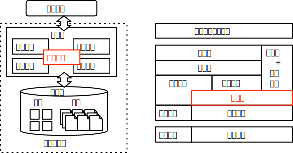

# 实验 4:查询处理

## 实验概述

本次实验为数据库系统查询处理的实验，意图通过实现基于火山模型的执行器引擎来更好地理解数据库系统如何按照查询算子逐级处理查询请求。

执行器是数据库系统将磁盘存储的页面数据处理为符合查询所需结果的模块。火山模型是一种经典的拉取式执行器模型，通过抽象算子的执行逻辑，上层算子逐层从下层算子拉取数据，算子内部完成处理后响应上层的拉取请求。通过这种方式可以在抽象结构上构建一种结构上非常简洁的执行器模型，便于在执行引擎上实现查询优化和异常处理。

<!--TODO:火山模型结构图-->

算子的实现是本次实验的难点。火山模型基于策略模式可以设计出不同的算子结构，并结合工厂模式可以快速创建不同类型的算子。系统根据查询计划树逐层生成算子，并调用算子的拉取函数完成查询的实际执行。部分算子在内部处理过程中需要存储中间结果来加速算子执行，例如连接算子以及聚合算子等，这种情况一般会使用内存作为中间结果的缓存。但是，部分算子在执行过程中将产生巨大存储容量的中间结果，不能够简单地存储到内存中（例如大表间的连接运算）。这类算子需要引入磁盘作为外部存储，一般称为外存算子，其中包括外存连接和外存排序算子。外存算子的执行效率对于磁盘 IO 的开销敏感，在实现上相较于内存算子更为复杂。本次实验要求补全几个常见的算子：连接、排序、Limit、聚合。考虑到不同算子本身实现难度的差异，基础功能中要求完成内存中的 NestedLoopJoin、MergeJoin 两类连接算子、排序算子以及 Limit 算子，高级功能在此基础上要求中引入内存资源的限制，并设计相应运算的外存算子，同时也可以选择实现难度较高的哈希连接算子以及聚合算子。

## 实验目标

本次实验要求完成如下基础功能：

1. 实现 Limit 算子。

2. 实现内存排序算子。

3. 实现内存连接算子：实现嵌套循环连接和归并连接两类连接算子。

在基础功能之上，实验框架支持完成以下高级功能：

1. 外存排序和连接算子：在内存排序和连接算子的基础上添加内存限制，使用外存储存中间结果，并设计内外存数据交互机制加速外存算法处理。

2. 内存哈希连接算子和聚合算子：实现内存存储的哈希表，并基于哈希表实现内存哈希连接算子以及聚合算子，中间结果利用哈希表保存。

## 关联知识点

本次实验关联查询处理与执行器章节，重点涉及如下的知识点：

1. 火山模型：本次实验需要充分理解火山模型的设计思路以及查询的实际执行流程。
2. 内存算子：本次实验的基础功能要求理解基于内存的连接、排序、聚合等算子的算法实现以及计算、存储代价分析。
3. 外存算子：本次实验的高级功能要求理解基于外存的连接、排序算子的算法实现以及计算、存储代价和 IO 代价分析。

## 相关代码模块

本次实验涉及到代码中如下的功能模块：

-   [excutors](https://github.com/thu-db/huadb/blob/main/src/executors)：执行器相关类
    -   [executor](https://github.com/thu-db/huadb/blob/main/src/executors/executor.h)：执行器算子的抽象模板，用于衍生出各类实际算子。
    -   [limit_executor](https://github.com/thu-db/huadb/blob/main/src/executors/limit_executor.h)：Limit 算子，用于限制输出数量。
    -   [orderby_executor](https://github.com/thu-db/huadb/blob/main/src/executors/orderby_executor)：排序算子，用于实现内存或外存的记录排序算法。
    -   [nested_loop_join_executor](https://github.com/thu-db/huadb/blob/main/src/executors/nested_loop_join_executor.h)：Nested Loop 连接算子，用于实现最基础的连接算法。
    -   [merge_join_executor](https://github.com/thu-db/huadb/blob/main/src/executors/merge_join_executor.h)：Merge 连接算子，要求底层算子节点已经完成排序，一种快速的连接算法。
    -   [hash_join_executor](https://github.com/thu-db/huadb/blob/main/src/executors/hash_join_executor.h)：（高级功能）哈希连接算子，需要补充哈希组件后实现，一种快速高效的连接算法。
    -   [aggregate_executor](https://github.com/thu-db/huadb/blob/main/src/executors/aggregate_executor.h)：（高级功能）聚合算子，依赖于哈希表结构，用于实现各类聚合算子的运算。

基础功能需要补充约 200 行代码，本次实验依赖于实验 1，请确保完成以上任务再开始本次实验。

相关功能模块的抽象示意图如下：

