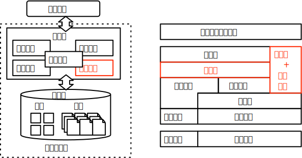

# 实验 5:查询优化

## 实验概述 { #intro }

本次实验为数据库系统查询优化的实验，意图通过查询重写和连接顺序选择来更好地理解数据库系统如何选择查询代价较低的执行计划。

查询优化是数据库系统提供高性能查询的关键组件。这一模块的相关研究自数据库系统起源以来一直广受学界和业界的关注。具体实现上，查询优化相关的算法种类丰富，覆盖范围囊括了查询重写、物化视图、连接顺序选择、索引选择、算子选择、代价估计等诸多方面。实验框架选择了其中比较经典且重要的部分作为本地的实验内容：查询重写和连接顺序选择。

查询重写按照查询等价转化规则修改查询计划树结构，本次实验涉及其中实现相对简单的算子下推规则，通过完成算子的下推可以优化扫描算子的执行和基数估计。连接顺序选择的难点有二：第一是连接算子执行代价的估计，不同表不同列之间一般不满足独立分布假设，显著提高连接代价估计的难度。第二是连接顺序选择算法的复杂度，在连接数量较多时，讨论所有的连接顺序组合将面临指数级的复杂度，对于系统负担过高。本次实验的基础功能要求实现选择和连接算子的下推功能，并降低了连接顺序选择的实现难度，仅要求在满足课程简化假设条件下实现的连接顺序选择。高级功能要求在此基础上添加投影算子下推功能，并使用基于数据画像优化基数估计过程，从而优化连接顺序选择功能。

## 实验目标 { #goal }

本次实验要求完成如下基础功能：

1. 选择和连接算子下推：补全优化器类中选择和连接算子下推的相关函数，实现选择算子下推。

2. 连接顺序选择：基于统计信息实现使用贪心算法的连接顺序选择。

在基础功能之上，实验框架支持完成以下高级功能：

1. 投影算子下推：补全优化器类中投影算子下推的相关函数，实现投影算子下推。需要维护查询数的下推后变化的数据列信息。

2. 连接顺序选择优化：实现基于动态规划算法的连接顺序选择，优化连接顺序选择的查找空间。

3. 基于数据画像的基数估计：使用数据画像方法实现更准确的基数估计，优化连接顺序选择的准确性。

## 关联知识点 { #knowledge }

本次实验关联查询优化章节，重点涉及以下知识点：

1. 查询重写：本次实验需要理解查询重写中算子下推的重写规则和具体实现方式。
2. 连接顺序选择：本次实验需要理解简化假设下连接运算的基数估计，高级功能要求理解基于数据画像的基数估计方法。

## 相关代码模块 { #code }

本次实验涉及到代码中以下功能模块：

-   [optimizer](https://github.com/thu-db/huadb/blob/main/src/optimizer)：优化器相关类
    -   [optimizer](https://github.com/thu-db/huadb/blob/main/src/optimizer/optimizer.h)：优化器类，需要补全算子下推功能以及连接算子重新排序的功能。

<!--TODO:添加Analyze相关函数-->

基础功能需要补充约 200 行代码，本次实验依赖于实验 1，请确保完成实验 1 再开始本次实验。

相关功能模块的抽象示意图如下：

