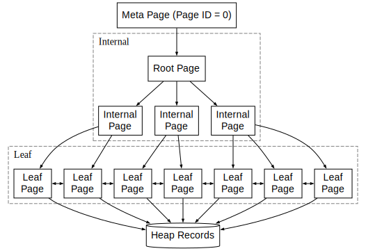

# 基础功能

## 测试说明

- 本实验和实验 2、3 独立，即所有功能均不考虑事务的并发控制、回滚和故障恢复。
- 本实验需要同学们正确实现实验 5 的谓词规范化和谓词下推优化。
- 本实验对测试用例的限制包含lab5说明文档中提到的所有限制，在此基础上还保证每张表上最多只会创建一个 B+ 树索引。
- 本实验存在 5 个公开测试用例和 30 个隐藏测试用例，每个测试用例分数均为0.4，共14分，实验报告1分。
- 本次实验的测试通过三种方式：
  - 通过 verify btree 检查 B+ 树是否满足部分性质
  - 通过 keyword 匹配判断 explain 命令输出的查询计划中期望关键词（SeqScan，BTreeScan，Filter，RidUnion）出现次数是否符合要求（是否出现，出现多少次）。
  - 通过比对查询结果来判断优化后的查询计划是否正确。
- 本实验不会测试同学们的连接顺序是否合理（即 `optimizer/join_reorder.cpp` 中的贪心算法是否正确）。

## 任务 1：完善 B+ 树页面结构（不单独计分）

本任务中，你将熟悉 B+ 树各类页面的角色与统一物理布局，并补全 `BTreePage::Init`、`BTreePage::AddRecord`、`BTreeIndex::SetRootPageId`、`BTreeIndex::GetRootPageId` 四个函数。这些是后续任务（索引创建、索引查找）的基石——后面所有读写页面的代码都要走这一层。

### 1.1 索引页面类型：meta / root / internal / leaf

B+ 树索引文件由若干个 `DB_PAGE_SIZE` 大小的页面组成。我们用 `BTreePageType` 区分它们的角色：

- **Meta page（`page_type_ = BTreePageType::META`，`page_id` 固定为 0）**
  整个索引的"门面"。不存放任何索引元组，只存元数据；目前的元数据只有一个 `root_page_id_`（指向 B+ 树当前的根节点）。索引被打开时，第一步永远是读 meta page 拿到 `root_page_id_`，然后再去访问实际的 B+ 树。
- **Root page（页面类型不固定）**
  B+ 树的根节点。**它本身可以是 internal page，也可以是 leaf page**：树只有一层（数据少到一个 leaf 装得下）时，root 就是唯一的 leaf；树有多层时，root 是最上层的 internal page。所以 root 是一个"角色"概念，不是一种独立的页面类型——`meta_page.root_page_id_` 指向谁，谁就是 root。
- **Internal page（`page_type_ = BTreePageType::INTERNAL`）**
  非叶子节点。每个槽位存一条路由用的索引元组，存储 key 和指向下层页面的 ID，按 key 升序排列。
- **Leaf page（`page_type_ = BTreePageType::LEAF`）**
  叶子节点。每个槽位存一条索引元组，存储 key 和指向堆表元组的 rid。所有 leaf page 通过 `prev_page_id_` / `next_page_id_` 串成一条**双向链表**——这条链是范围扫描（`WHERE k > ...`）能高效推进的关键。

它们之间的层级关系：



### 1.2 索引元组结构

索引元组 `IndexRecord`（`table/record.h`）继承自 `Record`，在用户列之外多带两个 `Rid` 字段：

```cpp
class IndexRecord : public Record {
  // 用户列 values_ 由父类 Record 持有
  Rid heap_rid_;  // 比较键的隐式末位列，作为 tiebreaker
  Rid ptr_;       // 下一层位置：内部节点指向子页面，叶子节点指向堆表行
};
```

序列化到页面字节流的顺序为 `[ptr_ | heap_rid_ | Record body]`，因此

```
IndexRecord::GetSize() = 2 * sizeof(Rid) + Record::GetSize()
```

（见 `table/record.cpp`）。

#### 三个字段在不同页面里的取值

| 字段 | leaf page | internal page |
|------|-----------|----------------|
| `values_` | 索引列的真实值 | 与子树**最左**叶子记录的 `values_` 相同 |
| `heap_rid_` | 与 `ptr_` 相同（即本索引项指向的堆表行 rid）| 与子树**最左**叶子记录的 `heap_rid_` 相同 |
| `ptr_` | 指向堆表中的数据行（= 本索引项对应的 `heap_rid`）| `{child_page_id, 0}`，`slot_id` 字段不使用 |

leaf 节点中 `ptr_ == heap_rid_` 看上去冗余，保留两份是为了让 leaf 和 internal 节点共用同一套序列化与比较代码——不必在每处使用 `IndexRecord` 时再分支判断。

#### 为什么需要 `heap_rid_`：用户键可能重复

要理解这个字段的作用，先要明确 internal page 的 slot 在 B+ 树中扮演的角色。我们约定：**每个 slot 的 key 等于其所指向子树中最小的 key**。在这一约定下，一个含有 n 个 slot 的 internal page 实际上把整个 key 空间切成了 n 个互不重叠的区间，每个区间对应一棵子树——形如 [k₀, k₁), [k₁, k₂), …, [kₙ₋₁, +∞)。路由逻辑只要判断查询 key 落在哪个区间里，就能唯一地选出该下探的子树。这正是 B+ 树能在每一层做出唯一选择、把查找代价压到树高的根本前提。

如果索引中所有 key 两两不同，这种区间划分天然成立：相邻 slot 的 key 必然严格递增，因为后一棵子树的最小 key 必然大于前一棵子树的最大 key。任意查询 key 都恰好落在唯一一个区间内，路由没有任何歧义可言——**结构本身就没有给重复留出位置**。

但非 unique 索引允许同一个 key 出现多次。当某个 key 重复次数足够多，对应的索引项会因 leaf page 容量限制被分裂到多个 leaf 中，而这些 leaf 又可能分属不同的子树。此时 internal page 中就会出现两个相邻 slot 的 key 完全相等的情形：

```
slot[0]: key=5  → child=P1
slot[1]: key=5  → child=P2
slot[2]: key=8  → child=P3
```

原本作为分界的 key 在这里失去了分界功能：区间 [5, 5) 宽度为零，key=5 这个值同时落在 slot[0] 和 slot[1] 所代表的两棵子树范围内，路由逻辑无法仅凭 key 判断该下探 P1 还是 P2。一旦在某一层无法做出唯一选择，要么"两棵子树都进去找"，要么依赖额外的回溯逻辑——无论哪种做法，该层的扇出度优势在重复 key 处都失效了。需要强调的是，这里失效的是路由阶段的对数复杂度：在最坏情况下（大量并列 key 导致多层 internal page 的边界都塌缩），仅仅是定位到第一条匹配记录所需访问的页面数，就会从 O(树高) 退化为接近 O(相关子树规模)，正好打破前面反复强调的"用扇出度换 I/O"这一核心设计。至于定位之后沿 leaf 链表读出所有匹配记录的代价，本就由结果集大小决定，与是否使用扩展键无关，不属于此处讨论的退化。

要修复这种边界塌缩，唯一的办法是让比较键变得两两不等。我们沿用 **PostgreSQL 的扩展键 (extended key) 思路**：把 `heap_rid_` 当作隐式末位列拼到 `values_` 之后，得到比较键

```
extended_key = (values_, heap_rid_)
```

由于不同堆表行的 `heap_rid` 必然两两不等，扩展键之间不可能出现相等的情形。每条 internal slot 的扩展键 = 它所辖子树中**最小**的扩展键，相邻 slot 的扩展键重新严格递增，区间划分重新干净，路由也就退化为"找最后一个 `extended_key <= 查询 key` 的 slot"，结果唯一。

#### 内部节点的 `heap_rid_` 是怎么来的

叶子节点的 `heap_rid_` 在 `Build()` 一开始就由被索引的堆行 rid 直接给出（`index/btree_index.cpp`）。当某层页面写满、需要往父层登记一条路由元组时，做法是**复制当前页面 slot[0] 的 `IndexRecord`，仅把 `ptr_` 改成指向当前页面**：

```cpp
auto parent_index_record = state->GetPage()->GetRecord(0, *schema_);
parent_index_record->SetPtr({state->page_id_, 0});
```

`values_` 和 `heap_rid_` 都从下层 slot[0] 顺势抄上来。这一步保证了"父节点元组的 `heap_rid_` = 子树最左叶子的 `heap_rid_`"这个不变式，并随着层层向上构建自然传播——不需要在 internal 节点上再独立维护 heap_rid 信息。

### 1.3 索引页面结构

参考 `index/btree_page.h` 的注释。**所有 B+ 树页面（meta / internal / leaf）都遵循同一套布局**——区别只在最末尾的 special 区里放什么。

```
+-------------+----------+----------+------------+-------------+
|  page_lsn_  |  lower_  |  upper_  |  special_  |  page_type  |
+-------------+----------+-------+--+------------+-------------+
|  slot[0]...slot[n-1],slots[n]  |         free space          |
+--------------------------------+-----------------------------+
                                 ^
                               lower_ -->

                <-- upper_
                      v 
+---------------------+----------------------------------------+
|     free space      |  index_record n,index_record n-1...    |
+---------------------+----------------------------------------+

                   special_ -->
                      v
+---------------------+----------------------------------------+
|  ...index_record 0  |  space remained for subclass           |
+---------------------+----------------------------------------+
```

1. **Header**：`BTreePageData` 这个结构体本身。
   - `page_lsn_`：用于 WAL；本实验不涉及恢复，可视作占位。
   - `lower_` / `upper_` / `special_`：三个偏移量，划分页面剩余区域。
   - `page_type_`：META / INTERNAL / LEAF。
   - `slots_[]` 是 C99 **柔性数组成员**，结构体本身不为它预留空间；`sizeof(BTreePageData)` 正好等于 header 的字节数，slot 数组就从这个偏移处开始向后增长。
2. **Slot 数组**：从 `sizeof(BTreePageData)` 向**右**增长到 `lower_`。每个 `Slot = {offset, size}` 描述一条记录，槽位**按 key 升序排列**。
3. **Free space**：`lower_` 与 `upper_` 之间。`GetFreeSpaceSize()` 返回 `upper_ - lower_ - sizeof(Slot)`——多扣掉一个 Slot 的位置，是为了保证插入时同时分配 slot + record 都不越界。
4. **Record 区**：从 `upper_` 向**左**增长。注意记录的**物理顺序**和它们在 slot 数组里的**逻辑顺序无关**——逻辑顺序由 slot 下标决定，物理上只是按插入时机往前挤。
5. **Special 区**：从 `special_` 到页面末尾，留给子类用：
   - `BTreeMetaPage` 存 `root_page_id_`；
   - `BTreeLeafPage` 存 `prev_page_id_` 和 `next_page_id_`；
   - `BTreeInternalPage` 当前不需要额外字段（`special_` 直接顶到页面末尾）。
   - 这块区域的大小等于 `sizeof(子类Data)`。

> **Meta page 是个特例**：由于它不存索引元组，`BTreeMetaPage::Init` 把 `lower_ = upper_ = special_` 全部压到 header 末尾。

## 任务 2：实现索引创建算法（4分，2个公开测试点，8个隐藏测试点，每个测试点0.4分）

现代数据库系统创建 B+ 树索引时有两条独立路径：**逐条插入**和**批量构建**。两者代价差距悬殊——前者每次插入都可能触发分裂、向上传播分裂边界；而后者可以利用"我已经看见所有数据"这一事实把树形完全确定下来再写盘，从源头上避开分裂。本实验要求的实现是 PostgreSQL 批量构建的精简版。

批量构建的关键洞察是：**只要让输入变成一个全局有序的流，B+ 树的构造就可以退化为"按顺序追加写"而不是"在中间插入"**。因此第一步是**全表扫描、收集索引元组、并按扩展键 `(values_, heap_rid_)` 做全局排序**——从堆表中扫出所有行，提取索引列与该行的 `heap_rid`，构造成 `IndexRecord`（叶子节点的 `ptr_` 和 `heap_rid_` 都填该堆行的 rid），随后用扩展键作为比较键做内存排序。为降低难度，假设所有索引元组能装进内存，不考虑外部排序。

输入有序之后，**叶子层的铺设就只是把元组依次往后写**：填满一页就分配下一页，并通过 `prev_page_id_` / `next_page_id_` 把前后两页双向链起来。由于元组本就有序到来，新元组要么追加到当前最右侧 page，要么触发分配下一页，**绝不会需要在已有页面中间插入**——这正是批量构建相比逐条插入最直接的收益：每个 leaf page 都是一次性写满后就不再修改的。

但仅有叶子层还不够，B+ 树需要 internal page 来支撑路由。**自底向上构造内部层**的做法是：每当某一层填满一页，就把该 page 的 `slot[0]` 复制一份提升到上一层 internal page 作为路由元组（仅修改 `ptr_` 指向该 page）；如果上一层也满，就再向更上一层提升，递归向上。这样做之所以正确，是因为输入有序、追加写入意味着**每个 page 的 `slot[0]` 永远是该 page 子树中最小的扩展键**——这恰好就是 1.2 节所要求的 internal slot 路由 key 的取值，路由约定沿着层级自然向上传播，无需任何额外计算。

最终最顶层只剩一个尚未填满的 page，它就是 root，把它的 `page_id` 写到 meta page，整棵树即告建成。

由于每条新元组只会落到当前最右侧的 page 上，**整个构造过程在每一层都只需追踪"最右侧那一页"的状态**，更左侧的页面一旦写满就再也不会被回访。我们用 `BTreePageState`（`index/btree_index.h`）表示这种状态——它持有当前正在追加的 `page_id_`、所在层级 `level_`、以及指向上一层 state 的指针 `parent_`。第 `L+1` 层的 state 是**惰性创建**的：只有在第 `L` 层第一次满页、需要写父节点时才分配——因为只剩一个 page 的层根本不需要父亲。


## 任务 3：实现删除表 (DROP TABLE ...) 时级联删除 B+ 树索引（0.8分，1个公开测试点，1个隐藏测试点，每个测试点0.4分）

删除表时，要先删除表对应的索引，再删除表格。DropIndex 函数已经写好，你需要在 DropTable 函数中调用它来删除索引。

## 任务 4：实现 B+ 树索引扫描功能（9.2分，2个公开测试点，21个隐藏测试点，每个测试点0.4分）

### 4.1 在优化器中实现 SeqScan 转 BTreeIndexScan，并实现 RidUnion 算子

经过实验 5 的谓词下推优化后，查询计划对一张表的访问只会是 `SeqScan` + 上方若干 `FilterOperator`，其中 SeqScan 把整张堆表扫一遍、Filter 在扫描结果上逐行过滤。当表上建有 B+ 树索引时，这种形态显然有改进空间：如果 `FilterOperator` 里的谓词恰好涉及索引列，我们就可以让 B+ 树把满足谓词的候选行直接挑出来，从而避开整张表的扫描。承担这一物理动作的算子就是 `BTreeIndexScan`——它接收若干谓词作为输入，在 B+ 树上确定一段 key 区间，沿叶子链扫出区间内的索引项，进而从堆表取出对应的行。

但 `BTreeIndexScan` 并非什么谓词都能消化：只有形式合法（`column op const`）且位置上落在索引列的"等值前缀 + 至多一个尾部范围"模式里的谓词，才能被翻译成索引扫描区间（具体判定见下一小节）。**优化器要做的事，就是在原本由 `FilterOperator` 持有的谓词集合中，识别出哪些可以变成这样的扫描区间、把它们融合进 BTreeIndexScan 内部，剩下的继续留在上方 `FilterOperator` 里事后过滤——这一融合动作本节称为"下推"。**最终改写出的形态是 `[FilterOperator ...] BTreeIndexScan`：方括号表示残留的 `FilterOperator` 可能为零（所有谓词都成功下推），也可能为若干条（只有部分谓词下推）。如果一条谓词都没法下推，那就连第一个索引扫描区间都构造不出来，整张子树只能维持原状不变（即 `FilterOperator ... SeqScan`）。

不过单个 `BTreeIndexScan` 只能消化 AND 合取式谓词：B+ 树的叶子层是按 key 全局有序的一条链表，一次索引扫描沿这条链走的是一段连续区间，而 OR 联结的取值（例如 a = 1 OR a = 5）在 key 空间里对应的是两段彼此分离的区间，单个算子扫不出来。为了把含 OR 的 WHERE 条件也统一塞进这个框架，优化器先把整体改写成**析取范式 (DNF)**——形如 `(p₁ ∧ p₂) ∨ (p₃ ∧ p₄) ∨ …`，每一项都是若干原子谓词的 AND。然后**对每一项独立走下推判定**，各得到一个子计划（可能是 `BTreeIndexScan`、可能是 `SeqScan`，可能各自上方还带 `FilterOperator`），最后用 `RidUnion` 算子把多个子计划返回的行去重合并。当 WHERE 条件本身就是单个 AND 合取式时，DNF 退化为只有一项，`RidUnion` 也就不需要出场。

本实验中，整个改写流程发生在谓词下推、连接重排之后，且**只对只读查询启用**（INSERT/UPDATE/DELETE 跳过此步）。

#### DNF 单项的下推判定

DNF 的一项是若干原子谓词的 AND 合取式。对其中每一条原子谓词，要被下推必须**形式上**和**位置上**都过关。

**形式上**——必须是 `column op const`：

- `op` ∈ {`=`, `>`, `>=`, `<`, `<=`}。
- 一侧是表的列、另一侧是常量。`column op column`（连接谓词或同表列比较）一律不下推。
- `const op column` 形式会被规范化为 `column op const`（左右互换并翻转 op），形式上等价。

**位置上**——必须沿索引列形成"等值前缀 + 至多一个尾部范围"。设索引列为 `(a, b, c)`，优化器从最左列 `a` 开始往右扫，每一步要求该列上**有一条等值谓词** `col = const` 才能继续；遇到第一个"没有谓词"或"谓词是范围"的列时停止。范围谓词若出现，只能出现在前缀的**末尾**，且只允许一条。前缀以内的谓词下推；前缀以外的、不属于索引列的、以及形式不合法的，统统留在 Filter 里。简言之：**索引扫描沿索引列从左向右一步一步走，每一步必须有一个等值常量"卡死"在该列上才能继续；只要某一步给的是范围而不是点，或根本没消息，索引扫描就止步于此**。

每条原子谓词按上述规则分入下推集或残留集后，整项的形态也就决定了：下推集非空则改写为 `[FilterOperator 残留集] BTreeIndexScan(下推集)`；下推集为空则维持 `FilterOperator SeqScan` 不变——这种情形最常见的成因是**没有谓词涉及索引的最左列**，连第一步都迈不出去。

举例，设表 `t(a, b, c, d)`，索引建在 `(a, b, c)` 上：

| 谓词 | 下推到 `BTreeIndexScan` | 保留为 `FilterOperator` | 说明 |
|------|------------------------|----------------|------|
| `a = 1` | `a=1` | — | 单列等值，最左列命中 |
| `a = 1 AND b = 2` | `a=1, b=2` | — | 等值前缀长度 2 |
| `a = 1 AND b = 2 AND c > 3` | `a=1, b=2, c>3` | — | 等值前缀 + 尾部范围 |
| `a = 1 AND c = 3` | `a=1` | `c = 3` | `b` 列断档，前缀止于 `a` |
| `a > 1 AND b = 2` | `a>1` | `b = 2` | 第一列就是范围，前缀立即终止 |
| `a = 1 AND d = 4` | `a=1` | `d = 4` | `d` 不在索引中 |
| `b = 2` | — | `b = 2`（走 `SeqScan`）| 最左列 `a` 没有谓词，前缀长度为 0 |
| `a = t.x` | — | `a = t.x`（走 `SeqScan`）| 不是 `column op const` |

#### 多项合并：`RidUnion`

`RidUnion` (`operators/rid_union_operator.h`，`executors/rid_union_executor.h` 和 `executors/rid_union_executor.cpp`) 在语义上类似于 SQL 的 `UNION`，但关键是区别是**它的去重不基于行的具体值，而是基于 rid**。这是因为同一行可能同时满足 DNF 的多项（例如 `a = 1 OR b = 2` 中某一行恰好 `a=1` 且 `b=2`），从而被多个子计划各自挑出一次，若不去重就会被返回多次；而 rid 是堆表中每一行的唯一物理地址——两条 rid 相同当且仅当它们指向同一行，因此按 rid 去重既不会漏判也不会误判，正确性有保证；同时 rid 比整行短得多，按 rid 比较也省去了把每一行所有列搬出来逐字段比较的开销，相比按行值去重要轻量得多。基于 rid 去重之后，`RidUnion` 再统一回堆表取出去重后的行作为输出。

`RidUnion` 合并的每一项各自的子计划可能是 `BTreeIndexScan`、可能是 `SeqScan`，可能各自上方还带 `FilterOperator`。举例（沿用上一小节表 `t(a, b, c, d)`，索引建在 `(a, b, c)` 上）：

- `a = 1 OR a = 2` → 两个 `BTreeIndexScan`（分别用 `a=1` 和 `a=2`），上方 `RidUnion`；
- `a = 1 OR b = 2` → 一个 `BTreeIndexScan`（`a=1`）+ 一个 `SeqScan`（带 `b=2` `FilterOperator`），上方 `RidUnion`

> 注意，`a != 1` 不应该被拆分为 `a < 1 OR a > 1`，而应该走 `FilterOperator`

### 4.2 实现 BTreeIndexScan 算子

#### 输入：扫描区间 `Segment`

`Segment` 描述索引列空间中的一段连续区间，由两个端点构成，每个端点包含两个分量：左端点是 `(left_val_, left_eq_)`，其中 `left_val_` 是一个与用户索引列同维的向量，`left_eq_` 是一个布尔标记，表示左端点本身是否包含在区间内（`true` 对应闭端 `[`，`false` 对应开端 `(`）；右端点 `(right_val_, right_eq_)` 同理。四种组合 `[lv, rv]`、`(lv, rv]`、`[lv, rv)`、`(lv, rv)` 由 `left_eq_` 与 `right_eq_` 的取值决定。

`Segment` 的端点基于 user key，而不是 1.2 节讲的扩展键——扩展键 `(values_, heap_rid_)` 是 B+ 树内部用来消除并列、保证路由唯一性的实现细节，对 `BTreeIndexScan` 不可见；优化器构造扫描区间时，看到的也只是用户写在 WHERE 子句里的谓词，自然也只能给出 user key。

当 `Segment` 对尾部列没有约束时，`left_val_` / `right_val_` 直接**只持有被实际约束的左对齐前缀**，未约束的尾列不出现——因此左右两端的前缀长度允许不同。例如索引建在 `(a, b, c)` 上、谓词为 `a = 1 AND b > 2`：`left_val_ = [1, 2]`、`left_eq_ = false`（来自 `b > 2`，等值列 a 也进入下界前缀）；`right_val_ = [1]`、`right_eq_ = true`（`a = 1` 给 a 一个上界，但对 b、c 都没有上界约束，前缀就此截止）。

#### 索引扫描算法

对一段 `Segment`，扫描分两阶段。

**Phase 1：树内定位**：调用 B+ 树提供的 `Search(left_val_, left_eq_)`，从 root 一路下探到 leaf。回顾 1.2 节，B+ 树内部节点按**扩展键** `(values_, heap_rid_)` 的全序进行路由，而 `Segment` 给出的左端点只有 user key——因此在内部节点比较前，需要把 `val` 配上一枚探针 `rid` 才能凑成完整扩展键。`btree_index.h` 中预置了 `MIN_RID` 和 `MAX_RID` 两枚探针 rid 供你使用；至于在闭端（`left_eq_ == true`）与开端（`left_eq_ == false`）下分别该选哪一枚、为何如此选，请结合 1.2 节"扩展键的全序消歧"自行想清楚【**针对这个问题的解答要写入实验报告，其中要说明为什么**】。

下探过程逐层执行**二分查找**，但两类节点扮演的角色不同：

- **internal 节点**：找出**最后一个扩展键 <= 探针**的 slot，沿其指针进入下一层。由于扩展键严格全序（`heap_rid_` 作为隐式末位列消除了并列），这一步结果唯一，无需"两棵子树都进去找"或回溯。
- **leaf 节点**：找出**第一条 user key >= 左端点**（闭端）或**第一条 user key > 左端点**（开端）的索引项，作为 Phase 2 的起点。leaf 这一步只需比较 user key，不再涉及 `heap_rid_`——它在内部节点完成路由消歧后，对最终的命中判定已无作用。

**Phase 2：沿叶子链顺序扫描**：从 Phase 1 拿到的位置出发，沿 leaf 的 `next_page_id_` 链一项一项往后读，每条索引项要判断它是否仍落在 `Segment` 内，一旦超过右端点就终止扫描。

## 报告要求 { #report }



此外，注意在文档中回答4.2节的思考题。

本次实验中，请在实验报告中描述你在每个函数中补充的代码所做的工作。此外，也欢迎在最后一次实验报告中谈一谈对这门课的体验感受以及课程建议等内容。
